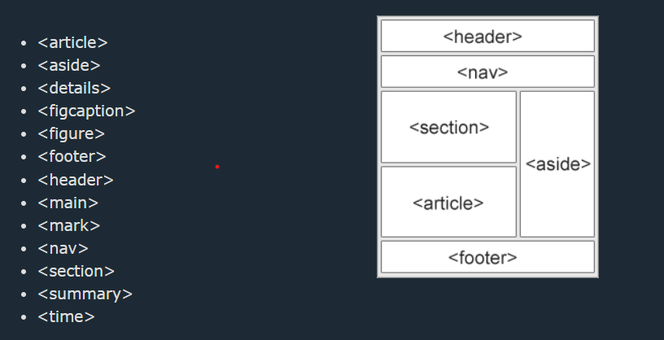

# Semantic Elements

A semantic element clearly describes its meaning to both the browser and the developer.

Examples of non-semantic elements: **`
`** and **``** - Tells nothing about its content.

Examples of semantic elements: **`<form>`**, **`<table>`**, and **`<article>`** - Clearly defines its content.

Many web sites contain HTML code like: 
 **`
`** **`
`** to indicate navigation, header, and footer.

In HTML there are some semantic elements that can be used to define different parts of a web page:

## All the semantic elements

| Tag                | Description                                                                                 |
| ------------------ | ------------------------------------------------------------------------------------------- |
| **`<header>`**     | Specifies a header for a document or section                                                |
| **`<footer>`**     | Defines a footer for a document or section                                                  |
| **`<main>`**       | Specifies the main content of a document                                                    |
| **`<section>`**    | Defines a section in a document                                                             |
| **`<nav>`**        | Defines navigation links                                                                    |
| **`<article>`**    | Defines independent, self-contained content                                                 |
| **`<aside>`**      | Defines content aside from the page content                                                 |
| **`<figure>`**     | Specifies self-contained content, like illustrations, diagrams, photos, code listings, etc. |
| **`<figcaption>`** | Defines a caption for a **`<figure>`** element                                              |
| **`
`**    | Defines additional details that the user can view or hide                                   |
| **`
`**    | Defines a visible heading for a **`
`** element                                     |
| **`<time>`**       | Defines a date/time                                                                         |
| **`<mark>`**       | Defines marked/highlighted text                                                             |
